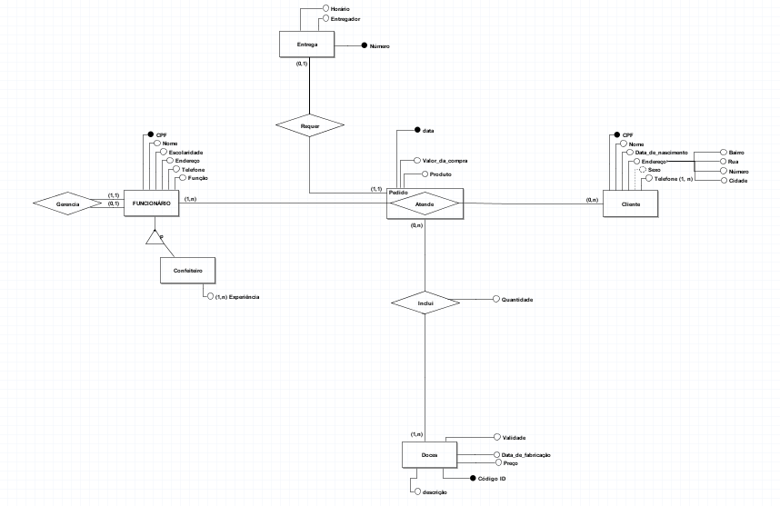

# Let's Brownie Database
Projeto desenvolvimento para a cadeira de Banco de Dados 1 do curso Sistemas para Internet do IFPB.

 

## Objetivos

- Digitalizar e organizar as operações da doceria, permitindo a gestão eficiente de funcionários (confeiteiros e atendentes), clientes, pedidos, produtos e entregas.
- Armazenar dados essenciais sobre funcionários, como gerenciamentos e experiências, além de clientes e seus contatos. 
- Registrar detalhes dos pedidos, produtos vendidos, e informações sobre entregas, facilitando a administração e o acompanhamento das atividades diárias da empresa.

 

## Modelo Conceitual

 

## Desenvolvedores
- Letícia Lopes Lima
- Laila de Aquino
- Pedro Lucas
- Suetone Carneiro